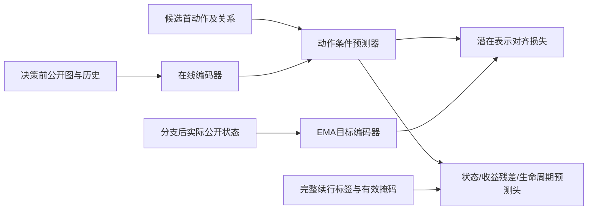

# 世界模型如何训练，和 GPPO 有什么关系

世界模型先在生产 W1 模拟器生成的分支数据上离线学习“当前公开情况＋一个候选动作会有什么后果”；再冻结参数，给 GPPO 提供候选动作先验。**后来补训的两个 830x 模型是 GPPO 策略，不是重新训练世界模型。**

## 一条训练样本怎么来

1. 在预定决策窗口冻结决策前公开输入：任务/UAV 等结构化信息、公开历史、时限、能量、有效性及合法动作 mask。
2. 对每个合法首动作，从同一窗口快照分别进行生产模拟器分支，包括合法 NOOP。
3. 执行这个首动作后，固定使用 `hungarian-v1-fixed` 续行至结束。
4. 保存后续公开状态、完整奖励序列与任务完成/过期/主机确认标签。未来信息仅用于监督和审计，不倒灌决策输入。
5. 用有效掩码区分可观察结果和 unknown；不能把没有观察到确认填成失败。

因此标签的语义是“首动作＋Hungarian 续行的结果”。接受命令不保证完成；首命令丢失后也可能被续行补救。它不是首命令独有因果贡献，更不是 GPPO 自己续行时的价值。

实际训练数据为 40 窗口、547 候选：

| 用途 | 父场景 | 窗口 | 候选 |
|---|---|---:|---:|
| 训练 | train-0064…0087 | 24 | 341 |
| 模型选择 | train-0088…0095 | 8 | 105 |
| 预测评价 | train-0096…0103 | 8 | 101 |

本研究内按父场景隔离；没有证明这些父场景在所有历史实验中均未使用。候选数量不等于独立样本数量。这些是模拟器数据，不是实飞遥测。

## JEPA 部分实际做什么

本地实现名为 Graph-JEPA：不同节点类型分别做 Linear/LayerNorm/SiLU 编码和类型内均值池化，再拼接成潜在表示；历史摘要经过 GRUCell，候选动作及关系编码与当前表示一同进入预测器。它不是已验证的完整图消息传递网络，也不是对参考论文全部实现的逐项复现。

预测器预测下一公开状态的潜在表示；目标编码器读取实际未来公开状态，停止梯度并通过 EMA 更新。训练让预测潜在表示接近目标表示，同时学习公开状态和任务相关后果。

具体配置：潜在维 64、hidden/history 128、动作数 25、EMA 0.99。主要输出为潜在转移、公开状态、6 维后果残差、3 个生命周期目标，以及 5 个自动事件目标。

| 损失 | 训练作用 |
|---|---|
| JEPA 潜在对齐 SmoothL1 | 预测后续状态表示 |
| 公开状态 SmoothL1 | 对齐可观察状态变化 |
| 后果残差 SmoothL1 | 修正透明参考的任务/能耗等后果估计 |
| 生命周期 masked BCE | 学习物理按时完成、过期、主机确认 |
| 防坍塌项，权重 0.04 | 防止表示退化为常量 |
| 自动事件 masked BCE | G1 权重 0；G2 权重 1 |

**G1 并非“完全没有任务事件监督”**：G1/G2 都有生命周期目标，差异是额外自动事件辅助损失。unknown 都按掩码处理。

优化器为 AdamW，学习率 0.001、weight decay 0.00001、梯度裁剪范数 5.0。每种方法训练 8201/8202/8203 三个种子；在选择集按 regret、后果 MAE、较早 epoch 依次选模型，保留原早停规则。

| 路线 | 实际 epoch | 选定 epoch |
|---|---:|---:|
| G1/8201 | 20 | 6 |
| G1/8202 | 19 | 4 |
| G1/8203 | 20 | 14 |
| G2/8201 | 20 | 8 |
| G2/8202 | 17 | 2 |
| G2/8203 | 18 | 3 |

六个模型完成保存、恢复及哈希核验。G1/G2 的总 loss 含不同项，不能直接比较总 loss 大小判断优劣。

## 接入 GPPO 的方式

冻结 G1 对合法候选预测后果残差，转换为先验并加到策略 logits。GPPO 仍使用多目标收益、偏好相似度和 PreCo；更新时回放与行为采样一致的先验、mask 和历史语义。

四臂是 G0（无世界模型先验）、T（透明先验）、G1（冻结世界模型先验）、H（Hungarian）。三个世界模型种子 8201/8202/8203 固定配对策略种子 8301/8302/8303；**任务阶段不是每个决策都做三世界模型集成**。离线预测报告中的集成指标与这种部署配对需区分。

每个策略路线训练 2,048 步；64 步 rollout，每次 4 次更新，共 128 更新。世界模型在这一阶段不更新，恢复实验前后三个世界模型状态哈希不变。

训练完成可以得到可部署策略 checkpoint 和可复算评价结果，但不保证正收益。现有证据已经表明：离线排序改善存在，G1＋GPPO 的最终调度收益与成本没有通过。本次固定 Hungarian 后果向 GPPO 先验的迁移假设未获任务结果支持。

来源：[真实世界模型报告](../evidence/world-model/RESEARCH_REPORT.md)、[模型绑定](../evidence/protocol/g1-model-binding.json)、[模型源码](../evidence/source/w1_graph_jepa.py)、[损失源码](../evidence/source/event_jepa_losses.py)、[训练源码](../evidence/source/production_world.py)、[四臂协议](../evidence/protocol/G1-GPPO-PROTOCOL.md)。源码为历史只读快照，不构成独立可运行项目。
