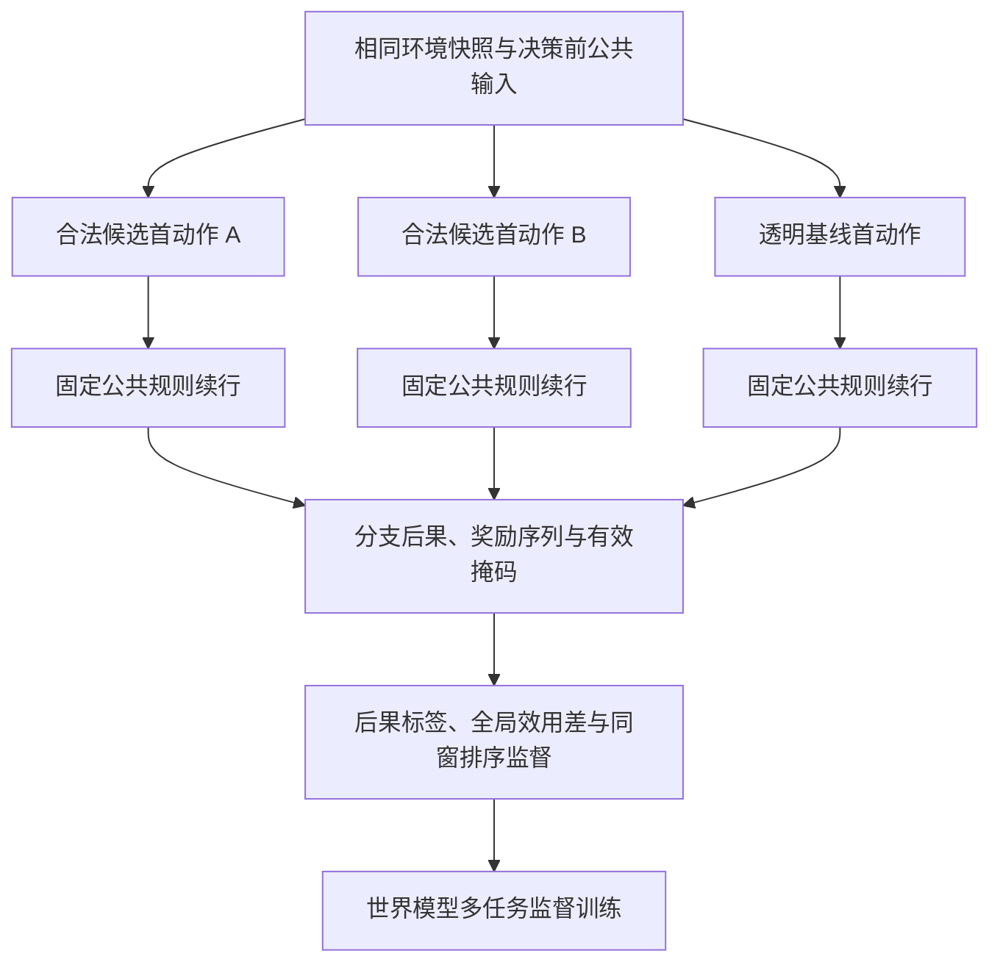

# 无人机动作后果世界模型：项目背景、训练方法与 GPPO 的关系

更新时间：2026-10-10。

本文说明基于反事实分支数据的动作后果世界模型，以及按窗口等权排序的 A/B 消融。世界模型采用**多任务监督学习**，不是通过 GPPO 策略梯度训练。它学习候选动作可能造成的后果；GPPO 则根据真实环境回报学习动作策略。

本文对应动作后果模型与 ranking-normalization 消融路线。仓库中的历史世界模型说明可能采用不同数据、优化器、续行规则和接入方式，不能把不同路线的配置混合解释。

## 项目背景与研究路线

### 为什么需要预测调度动作的后果

多架无人机需要在任务时限、有限电量、故障和通信不及时的条件下，协同完成动态任务。项目围绕弱通信条件下的多无人机动态任务分配开展机制研究，进一步探索动作后果世界模型能否帮助强化学习改善调度。

调度不能只看“哪架无人机离任务最近”。一个分配动作会影响后续资源占用、其他任务的时限和机队总能耗：

- 派最近的无人机执行当前任务，可能占用后续紧急任务需要的资源。
- 当前任务完成了，但等待中的其他任务可能因此过期。
- 派更远的无人机可能增加能耗，却提高整个任务系统的完成率。
- 通信延迟可能让主机依据过时的位置、电量或任务状态作出决定。

因此，局部合理的动作不一定带来更好的全局结果。研究目标是预测候选动作对整个任务系统的影响，并验证这些预测是否具有实际决策价值。

当前使用简化模拟环境：四架无人机、最多六个任务槽，包含时限、电量、损毁和通信相关机制。非法动作通过合法动作 mask 提前排除。碰撞尚未实现，不能声称已验证避碰能力；模拟结果也不能直接等同于实飞表现。

### 各模块分别负责什么

| 模块 | 主要问题 | 依据或作用 |
|---|---|---|
| GPPO 策略 | 当前应该选哪个动作？ | 根据真实模拟环境轨迹、奖励和优势学习动作策略 |
| 世界模型 | 候选动作可能造成什么后果？ | 根据反事实分支的真实后果进行监督学习 |
| 透明基线 | 固定、可解释的调度规则会怎么选？ | 提供同窗口候选比较的参照分支 |
| 模拟器 | 动作在当前环境机制下实际造成什么结果？ | 生成状态演化、事件、奖励和后果标签 |

GPPO 的 actor 更新动作概率，critic 拟合真实回报。世界模型预测任务完成、过期、能耗和效用等后果；本次训练不使用 GPPO 的 actor loss。

后续可以研究把世界模型输出作为策略特征、先验或 critic 信息，但每种接入方式都需要独立验证。预测准确不自动等于调度收益提升；当前 A/B 消融也不预先证明任何 GPPO 接入有效。

### 腾讯会议建议如何落实

会议围绕任务时限、故障与合法动作过滤，提出优先优化世界模型、引入反事实推演，并加强对好动作的监督。当前方案将这些方向落实为可核验的数据和损失设计：

| 会议方向 | 当前实现或研究边界 |
|---|---|
| 预测动作后果 | 同时预测目标任务、其他任务、能耗、全局效用和未来状态 |
| 引入反事实推演 | 从同一快照分别执行合法首动作，后续遵循同一公共规则 |
| 预测好动作，而不只是事件概率 | 使用同窗口真实效用差作为回归和动作排序监督 |
| 优化损失函数 | 按标签类型采用 masked BCE、Huber，并加入 pairwise ranking |
| 将预测作为强化学习先验 | 保留为后续待验证方向；当前实验仅研究离线排序归一化 |
| 剔除不良数据 | 排除损坏或不可信样本，保留有效的负效用分支用于学习 |

仅把 MSE 换成 BCE 或 Huber，不能自动解决复杂、多峰的未来分布。当前改动让损失匹配标签类型，并增加与决策相关的监督；是否改善预测和选择质量，仍需实验判断。

会议曾提出阶段汇报与项目完成时间。本文不把历史会议中的相对时间转成当前截止日期；当前进度以部署、验收和正式实验记录为准。

### Graph-JEPA 相关结构的作用

调度输入包含无人机、任务等多种实体，以及候选动作和关系信息。模型编码决策前公共结构与历史，再结合候选动作预测分支后状态和任务后果。

JEPA 部分预测未来状态的潜在表示，并与目标编码器产生的表示对齐；后果预测头把表示映射到任务完成、过期、能耗和全局效用等目标。两部分分别承担状态表示学习和决策相关监督。

采用 Graph-JEPA 相关结构不代表模型已经掌握完整环境机制，也不代表完整复现了参考论文的方法。实现中包含节点类型编码和池化等操作，不能仅凭模型名称宣称采用了完整图消息传递网络。

### 已有发现与当前研究问题

历史动作后果模型完成训练后，在离线预测门停止。它有局部正收益案例，但也出现全局效用高估和重大负增量。监督审计没有证实这些案例来自标签缺失或分支配对错误，因此不能简单归结为“忘了监督其他任务”。详细数值和统计口径见第 7 节。

此前的工程技术停止反映部署、输入合同或资源接线问题；离线预测门失败才提供了关于模型选择效果的负面证据，两类停止不能混为一谈。

当前实验收窄到一个具体问题：**候选对较多的窗口在排序损失中占更大权重，是否影响模型的动作选择表现？** A 对有效 pair 等权，B 在每个窗口内部平均后，再对当前 batch 的有效窗口等权。六路新模型保持数据、种子、初始化、训练顺序、架构和其他损失一致，只改变这一项。

实验在预先冻结的 24 个评价父场景上比较 regret、重大损失、最差场景和跨种子稳定性。它检验排序归一化的影响，尚不能证明 GPPO 收益提升或认证风险安全。按本次状态记录，服务器预检已通过，正式六路训练仍未启动。

对外介绍项目时，可使用以下表述：

> 本项目研究弱通信条件下的多无人机任务调度，通过反事实分支训练动作后果世界模型，预测候选动作对任务完成、过期和能耗的全局影响。已有模型出现局部改善，但整体收益与重大损失表现未通过离线门控。目前准备开展严格配对的排序归一化消融，检验窗口权重是否影响预测和动作选择质量。

## 1. 训练数据如何生成

对每个有合法选择机会的窗口，保存同一个环境快照，并从该快照恢复多个独立分支。各分支强制执行不同的合法首动作，随后统一采用固定公共规则 `public-joint-opportunity-rule/1` 续行，保存后果和奖励序列。

这种配对方式比较的是：**在相同起点下，更换第一步动作、随后遵循相同规则，会产生怎样的结果差异。** 未来轨迹仅用于生成监督标签和审计，不能进入决策前的模型输入。

合法 NOOP 分支也可以参与比较。NOOP 没有目标任务时，其目标任务标签保持 unknown；仍可保留有效的全局效用和其他任务标签。没有选择机会的窗口不应伪造候选动作或训练标签。

这些数据来自模拟器，不是实飞遥测。候选分支共享父场景和窗口，257 个候选不能当作 257 个独立场景样本。

## 2. 历史训练与当前 A/B 配置

| 项目 | 配置 |
|---|---|
| 训练父场景 | 24 个 |
| 有机会训练窗口 | 58 个 |
| 训练候选分支 | 257 个 |
| 世界模型随机种子 | 8201、8202、8203 |
| 每个模型训练量 | 40 epochs，320 次更新 |
| 窗口 batch 大小 | 8；每 epoch 为 8 个 batch，最后一个 batch 不满 8 个窗口 |
| 优化器 | Adam |
| 学习率 | $3\times10^{-4}$ |
| 梯度裁剪范数 | 0.5 |
| checkpoint 规则 | 仅取最终完整 checkpoint，不按评价表现挑选 |

当前冻结的 A/B 消融复用已核验的 288 个历史窗口缓存：174 个 `complete`、114 个 `no_opportunity`，其中只有 58 个 train complete 窗口进入训练。

A/B 各训练三个种子，共六路新模型、1,920 次世界模型更新。同一 seed 的两臂配对初始化、窗口顺序和 batch 边界相同，只改变排序损失的归一化方式。旧 8201 checkpoint 不用于初始化任何 A/B 模型。

按本次提供的状态记录，v7 已完成服务器部署和无授权 preflight；**正式 A/B 训练尚未启动，尚无 A/B 效果结果。** 工程验收不等于模型有效性证据。该状态是 2026-10-10 的记录，不表示此后状态自动更新。

## 3. 环境奖励与候选动作效用

### 3.1 两个目标的向量奖励

当前配置包含 6 个任务槽、4 架无人机，每架初始能量为 9。任务目标为：

$$
r_t^{\mathrm{task}}=
\frac{\text{新增完成任务数}-\text{新增过期任务数}}{6}.
$$

能耗目标为：

$$
r_t^{\mathrm{energy}}=-\frac{\text{本步能耗}}{36},
\qquad 36=4\times9.
$$

代码按环境配置中的任务容量和机队初始总能量归一化；6 和 36 是本配置的值，不能直接套用于所有环境。

完成任务提高任务奖励，任务过期降低任务奖励，消耗能量降低能耗目标。统计覆盖整个任务系统，因此其他任务新增过期也会计入。

### 3.2 固定续行规则下的标量效用

候选分支的标量效用为：

$$
U(s,a)=\sum_{k=0}^{T}0.99^k
\left(0.4r_{t+k}^{\mathrm{task}}+0.2r_{t+k}^{\mathrm{energy}}\right).
$$

这里 $k$ 按保存的分支环境步计数，$T$ 是该分支最后一个计入回报的步索引；不是直接按物理秒数折扣。

以同窗口透明基线分支为参照，构造：

$$
\Delta U(s,a)=U(s,a)-U(s,a_{\mathrm{transparent}}).
$$

- $\Delta U>0$：在固定续行规则下，候选优于透明基线。
- $\Delta U<0$：在固定续行规则下，候选劣于透明基线。
- $\Delta U=0$：效用相同，不构成不等值排序对。

**这个效用条件于固定续行规则。** 它不是动作在任意后续策略下的价值，也不是最优 $Q(s,a)$。接入 GPPO 后如果续行策略改变，预测是否仍有用需要另行验证。

## 4. 世界模型输入与预测目标

输入包含决策前公共状态、图结构、公共历史、合法候选动作及关系信息。决策前 `event_signal` 和有效性字段必须遵守公共前缀合同；合法 false 与 unknown 必须区分。真实未来状态、轨迹和奖励只进入监督侧。

| 输出 | 预测内容 |
|---|---|
| 二值后果 | 到达、按时完成、过期、损毁、碰撞、主机确认 |
| 连续后果 | 其他任务完成差、其他任务过期差、能耗差、电量差、损毁数量差、竞争变化、全局效用差 |
| 逐任务后果 | 六个任务槽各自的完成差和过期差 |
| 公共状态 | 分支后公共状态表示 |
| 潜在表示 | 分支后状态的潜在表示 |

连续增量标签按各自冻结标签合同生成，不应把所有增量都解释为绝对终局计数。

模拟器目前未实现碰撞，因此碰撞标签保持 `unknown`，不进入该头损失。**unknown 不等于失败，也不等于零。** 有预测头仅说明训练目标存在，不能证明预测准确或风险安全。

## 5. 多任务损失函数

总损失为：

$$
L_{\mathrm{world}}=
L_{\mathrm{latent}}+0.1L_{\mathrm{public}}
+L_{\mathrm{binary}}+L_{\mathrm{continuous}}
+L_{\mathrm{task}}+L_{\mathrm{ranking}}
+0.01L_{\mathrm{anti-collapse}}.
$$

### 5.1 二值后果：masked BCE

使用 `BCEWithLogits`，只在标签有效的位置计算。无有效标签时返回可微的零，不把 unknown 当作负例。

### 5.2 连续、逐任务与公共状态：Huber

使用 `SmoothL1Loss(beta=1)`：

$$
L_{\mathrm{continuous}}=\operatorname{Huber}(\hat y,y).
$$

逐任务后果和公共状态也使用 masked Huber。当前各头按展平后的有效元素求均值；A/B 消融不改变这些头的归一化和权重。

### 5.3 潜在表示：目标编码器对齐

$$
L_{\mathrm{latent}}=
\operatorname{Huber}(\hat z,\operatorname{stopgrad}(z_{\mathrm{target}})).
$$

目标编码器读取真实分支后状态，目标表示停止梯度。目标编码器仍通过 EMA 跟随在线编码器更新；停止梯度不表示它永久固定。

### 5.4 同窗口候选排序

令 $y_i=\Delta U_i$，$\hat y_i$ 为模型连续头中的 `global_utility_delta` 预测。若同窗口真实 $y_i>y_j$，希望预测也满足 $\hat y_i>\hat y_j$：

$$
\ell_{ij}=\operatorname{softplus}
\left[-\operatorname{sign}(y_i-y_j)(\hat y_i-\hat y_j)\right].
$$

排序直接使用全局效用差预测头，没有另设独立排序分数。有效 pair 必须满足：

1. 三元窗口身份 `(parent, repeat, window_id)` 相同。
2. 两个候选的效用标签都有效。
3. 真实效用不相等。

不同窗口不能组成排序对；重复采样的窗口也必须通过 `repeat` 区分。

设当前 batch 内窗口 $w$ 的有效 pair 集为 $P_w$，有至少一个 pair 的窗口集合为 $W_+$。两臂定义为：

$$
L_A=\frac{\sum_{w\in W_+}\sum_{(i,j)\in P_w}\ell_{ij}}
{\sum_{w\in W_+}|P_w|},
$$

$$
L_B=\frac{1}{|W_+|}\sum_{w\in W_+}
\frac{1}{|P_w|}\sum_{(i,j)\in P_w}\ell_{ij}.
$$

A 对所有有效 pair 等权；B 先在窗口内平均，再对有效窗口等权。没有有效 pair 的窗口不进入分母；整个 batch 没有有效 pair 时，两者返回可微的零。

例如，一个窗口有 1 对、另一个有 6 对：A 的窗口总权重为 1:6，B 为 1:1。**B 的等权范围是当前训练 batch 内的有效窗口**，不自动保证所有窗口在完整训练过程中的累计权重完全相同。

### 5.5 防止潜在表示坍缩

$$
L_{\mathrm{anti-collapse}}=
\operatorname{mean}\left[\max(0,0.1-\operatorname{std}(z))\right].
$$

在有效潜在样本上按维计算标准差，使用 `unbiased=False`。有效样本少于两个时返回可微的零。该项用于抑制表示退化为常量，不能直接作为任务收益证据。

## 6. 世界模型与 GPPO 的区别

| 项目 | 世界模型 | GPPO |
|---|---|---|
| 学习问题 | 候选动作会造成什么后果 | 当前状态应选择什么动作 |
| 数据 | 同起点候选分支及固定规则续行结果 | 策略与真实模拟环境交互的轨迹 |
| 监督信号 | 后果标签、有效掩码、同窗效用排序 | 任务与能耗奖励、真实回报及优势 |
| 主要优化目标 | BCE、Huber、排序与表示损失 | critic 回报拟合和 actor 策略更新 |
| 当前 A/B 是否运行 | 待执行六路新训练 | 不运行，策略更新固定为 0 |

世界模型的 $\Delta U$ 是后果回归和动作排序标签，不能直接等同于 GPPO 的逐步奖励，也不能直接替代真实环境回报。此前的 GPPO 接入实验属于另一项研究，不能用其结果替代当前 A/B 消融。

## 7. 已知结果、数据处理与当前实验边界

历史动作后果模型已在离线预测门停止。已审阅评价数据的父场景宏平均改善约为 **+0.001259**，窗口加权改善约为 **−0.003871**，父场景 bootstrap 95% 区间跨零。58 个机会窗口中，17 个更好、21 个更差、20 个沿用透明动作；重大负增量为 5/58，即 **8.62%**。

冻结门报告的 **6.944%** 是父场景损失率的宏平均，与 5/58 的窗口比例分母不同，不能互换。部分正收益回放展示的是局部案例，不能证明整体方案有效。

监督审计支持：训练标签包含坏动作及同窗更好动作，五例损失没有被证实来自标签缺失或配对错误。现有证据也不能证明排序权重不均是这些错误的原因。因此预注册 A/B 只改变排序归一化，不同时添加尾部损失、调阈值或筛选样本。

**保留可信的坏动作分支。** 负效用、过期等结果能帮助模型学习避免不良动作。应排除的是身份错误、配对错误、数据损坏或标签不可信的样本；不能因为结果不好就删除有效负例。

当前 A/B 须等六个最终 checkpoint 完成核验后，才在 24 个预先冻结且尚未查看结果的父场景上生成共同反事实结果。主要比较按父场景配对计算 B−A regret，并同时报告重大损失、最差场景和跨 seed 稳定性。旧评价父场景仅作开发诊断。

本消融固定 **GPPO 更新为 0、任务评价 episodes 为 0**；反事实候选分支评价单独计量。即使排序改善，也需要后续独立实验验证策略收益和完整决策成本。本路线属于模拟器开发探索，不构成实飞验证或 5% 风险认证。

## 8. 实现核对位置

本文对照了最终 v7 包中的静态实现；撰写和发布文档不执行模型加载、forward、训练或研究评价。

| 文件 | 对应内容 |
|---|---|
| `consequence_collection.py` | 同快照候选分支、固定续行、折扣向量回报和标量效用 |
| `consequence_contract.py` | 标签字段、有效性、种子与折扣系数 |
| `consequence_model.py` | masked 多头损失、A/B 排序 reduction 与防坍缩 |
| `consequence_training.py` | Adam、40 epochs、batch 8、裁剪、EMA 与更新日志 |
| `vendor/w1_graph_jepa.py` | 目标编码器、停止梯度与 EMA 更新 |
| `native/gppo_world/joint_training.py` | `_vector_reward` 的任务及能耗归一化 |
| `experiment-matrix.json` | 六路配对实验、数据复用和评价屏障 |

上述文件名是本地冻结包的实现索引，不表示本次将完整代码、checkpoint 或轨迹上传到了仓库。

> 世界模型学习“候选动作在固定续行规则下会造成什么后果”；GPPO 学习“真实交互中应如何选择动作”。当前 A/B 检验窗口等权排序能否改善离线选择表现，在取得结果前不宣称调度效果提升。
