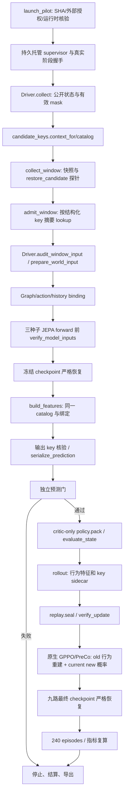

# 候选身份生产调用图

| 边界 | 实际断言与保存位置 |
| --- | --- |
| collector | validate_catalog；窗口 candidate_context/keys/candidate_audits.collector |
| branch snapshot | 快照 JSON 全 catalog 与 branch_snapshot audit；restore 探针保存单 key 和同一序列摘要 |
| label lookup | validate_window；by_key[key_digest]；每个 label 的 key/摘要和 label_lookup audit |
| graph/action encoding | prepare_world_input/bind_model_input 与公开原图、history、action、relation 对齐；identity audit journal |
| world-model input/output | ConsequenceJEPA.forward 与 FrozenEnsemble.predict 输入绑定及输出 key 校验；绑定 sidecar/输出摘要 |
| prediction export | serialize_prediction 严格单 key/slot 验证；prediction_cache 的 key/context/audit |
| candidate_features | build_features trace 的 graph/feature/input audit；pack 后 tensor digest 与完整 catalog |
| replay | replay_evidence 保留公开 context/catalog 和行为 feature 摘要；verify_replay_candidate 在重建前校验 |
| GPPO | 原生 preference/weighted update 首段调用 verify_update；其写 GPPO candidate audit 后才重建行为概率或更新 |

candidate_sequence_sha256 在所有适用层一致。缺失预测、outside-support 与无机会没有伪造 world-model/input/output audit；它们记录基础路径及有效 catalog，实际世界模型调用为 0。行为 key 不要求当前策略参数永远不变；策略/适配器重算与原 GPPO 梯度路径继续保留。
# v4 event_signal boundary

`M10Environment._observation` → `public_controller.public_copy` → `collect_window.state_before` → `restore_candidate` pre-action projection → `consequence_contract`/labels → `graph5_from_m10_observation` → `candidate_keys.bind_model_input` → prediction export → replay/GPPO verifier.

Each edge carries `event_signal`, `event_signal_valid`, and the public prefix digest. `valid=false`, missing, type changes, or pre/post-action digest changes stop before model forward. The restored branch may not replace the pre-action value with an internal post-action trigger read.
